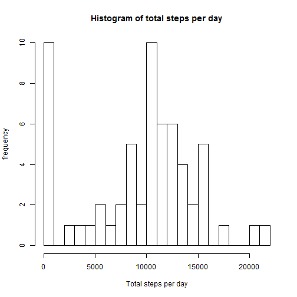
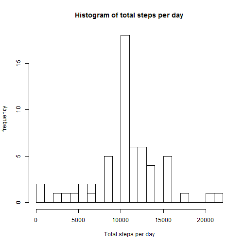
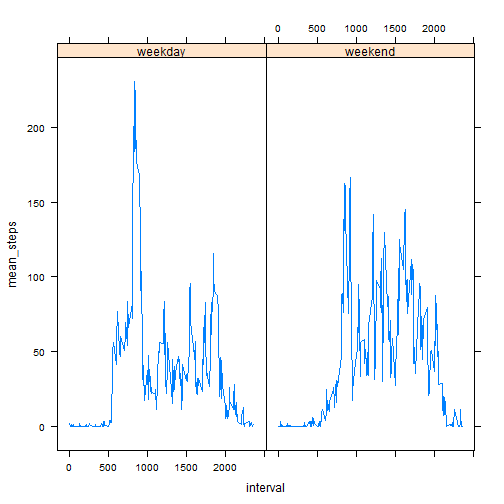

# Reproducible Research Peer Assessment 1
Author: Joshua Smith

## Introduction
This project follows the rubric of Peer Assessment 1 in the    Reproducible Research class from Coursera.com. This project analyzes data from a personal activity monitoring device. This document analyzes the steps taken during various time periods and displays this information graphically. 

The dataset being analyzed reports the number of steps taken at each 5 minute interval
every day during the months of October and November of 2012. Data was collected
anonymously. The original dataset was downloaded from the Reproducible Research Peer Assessment 1 webpage.  

Variables in the original dataset include:  

- steps: Number of steps taking in a 5-minute interval
- date: The date on which the measurement was taken in YYYY-MM-DD format
- interval: Identifier for the 5-minute interval in which measurement was taken

# Loading and processing data

This code loads data from the working directory into a dataframe, raw_data.


```r
raw_data <- read.csv2("activity.csv", header = TRUE, sep = ",")  ##reads data from comma delimited csv document
```


# What is mean total number of steps taken per day?

This code creates a matrix agg_date containing the total sum of steps per day. A histogram displays the frequencies of this data. The mean and median of steps per day are then reported. NAs are are ignored.


Histogram

```r
agg_date <- rowsum(raw_data$steps, ##creates new dataframe of rowsums
                   group = raw_data$date, ##groups by date
                   na.rm = TRUE) ##ignores NAs

sum_date <- agg_date[,1] ##creates integer of sums

hist(sum_date, ##plot histogram from sum_date integers
     main = "Histogram of total steps per day", ##title
     xlab = "Total steps per day", ##x-axis label
     ylab = "frequency", ##y-axis label
     breaks = 20) ##increase number of breaks for visibility
```

 


Mean and Median steps per day

```r
mean(sum_date)  ##calculates mean number of steps per day
```

```
## [1] 9354
```

```r
median(sum_date)  ##calculates median number of steps per day
```

```
## [1] 10395
```


# What is the average daily activity pattern?

This code creates a new casts a new dataframe, cast_interval, of the number of steps per interval averaged across all days using the reshape2 package. A time-series plot of the 5-minute interval (x-axis) and the number of steps averaged across all days (y-axis) is created. It then reports the interval with the highest average steps. NAs are ignored.

Time-series plot

```r
library(reshape2)
```

```
## Warning: package 'reshape2' was built under R version 3.0.3
```

```r

raw_data_na <- na.omit(raw_data) ##ignore NAs

melt_interval <- melt(raw_data_na, ##melt dataframe
                      id = "interval", ##assign id
                      measure.vars = "steps") ##assign variable

cast_interval <- dcast(melt_interval, ##cast new dataframe
                       interval ~ variable, ##assign relationship
                       mean) ##function

plot(cast_interval$interval, ##create plot
        cast_interval$steps, ##dataset
        xlab = "Interval", ##x-axis label
        ylab = "Average Steps", ##y-axis label
        main = "Average steps per interval", ##title
        type = "l" ##time-series linear plot
        )
```

 


Interval with the highest number of steps:

```r
cast_interval[cast_interval$steps == max(cast_interval$steps), ]  ##report interval with max number of steps and number of steps
```

```
##     interval steps
## 104      835 206.2
```


# Imputing missing values

This code reports the number of missing values ("NA"). A new dataframe (raw_data.norm) is created using the package plyr in which the NA values are replaced with the mean from the corresponding interval. A new histogram of the frequency of the sum of steps is created, and then the mean and median number of steps per day are reported. These results should be compared to the results of the histogram, mean, and median ignoring NAs reported above. Replacing the NAs creates a significant difference in these values.  

The NAs are replaced using the mean number of steps for the corresponding interval. The interval mean was chosen over the mean for the date because of the more focused granularity.  

Histogram with replaced NAs.

```r

library(plyr) ##loads the plyr package
```

```
## Warning: package 'plyr' was built under R version 3.0.3
```

```r

raw_data.agg <- ddply(raw_data, ##splits dataframe
                      c("interval"),  ##establishes group to split
                      function(raw_data) ##function to calculate during split
                              data.frame(mean_interval=mean(raw_data$steps, na.rm=TRUE)))

raw_data.norm <- join(raw_data, ##joins the split dataframe to the original dataframe
                      raw_data.agg, ##specifies split dataframe
                      by=c("interval"), ##specifies group for join
                      type="left") ##defines type of join

raw_data.norm$steps <- ifelse(is.na(raw_data.norm$steps), ##create loop function identifying NA, replaces NA
                              raw_data.norm$mean_interval, ##replacement value
                              raw_data.norm$steps) ##non-altered value

raw_data.norm$mean_interval <- NULL ##drops uneccesary column

 agg_steps.norm <- rowsum(raw_data.norm$steps, group = raw_data.norm$date, na.rm = TRUE)
 
sum_steps.norm <- agg_steps.norm[,1]

hist(sum_steps.norm, main = "Histogram of total steps per day", xlab = "Total steps per day", ylab = "frequency", breaks = 20)
```

 


Mean and Median with replaced NAs

```r
mean(sum_steps.norm)
```

```
## [1] 10766
```

```r
median(sum_steps.norm)
```

```
## [1] 10766
```


# Are there differences in activity patterns between weekdays and weekends?

This code creates new factor (weekpart) in the dataframe. The date column is reclassed as a Date object, and then the weekdays() function is applied into a new column. A loop is created to assign the value "weekday" or "weekend" to the corresponding weekday. Then a lattice time-series plot is created to display the number of steps per interval averaged across the dates by weekend and weekday. The dataframe with the replaced NAs is used.


```r
raw_data.norm$date <- as.Date(raw_data.norm$date) ##reclass date column as class type date

raw_data.norm$weekday <- weekdays(raw_data.norm$date) ##create new column associating the weekday with the date

weekpart <- character() ##creates empty character for weekpart

for (d in raw_data.norm$weekday) { ##begins loop to assign weekend or weekday to each date
        if (d == "Monday" | d == "Tuesday" | d == "Wednesday" | d == "Thursday" | d == "Friday") { ##reassigns weekdays as "weekday"
        	wp <- "weekday"
		}
	if (d == "Saturday" | d == "Sunday") {
		wp <- "weekend" ##reassigns weekend days as "weekend"
		}
	weekpart <- rbind(weekpart, wp) ##assembles recoded days into weekpart character. 
	}

raw_data.norm$weekpart <- as.factor(weekpart) ##binds weekpart column to dataframe

library(lattice) ##loads lattice package
```

```
## Warning: package 'lattice' was built under R version 3.0.3
```

```r

week_agg <- ddply(raw_data.norm, ##creates new dataframe split
                 c("interval", "weekpart"), ##defines split identifiers
                 function(raw_data.norm) data.frame(mean_steps=mean(raw_data.norm$steps))) ##defines function

xyplot(mean_steps ~ interval | weekpart, ##creates plot
       data = week_agg, ##uses week_agg dataframe
       type = "l") ##defines time-series linear plot
```

 


